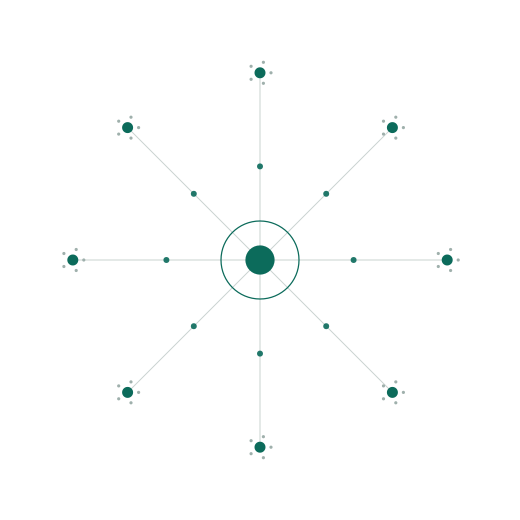

<h1 align="center">Trustworthy Privacy-Preserved Federated Learning for Science</h1>

  <b>Birds-of-a-Feather</b> · Trillion Parameter Consortium 2026 (TPC26) 
  Baltimore, Maryland · Tuesday, June 2, 2026

  <picture>
    <source media="(prefers-color-scheme: dark)" srcset="docs/federation-dark.svg">
    
  </picture>

<i>The models travel between institutions. The sensitive data never does.</i>

  <b><a href="https://ornl.github.io/RealWorld_FL/">Visit the session website →</a></b>

---

|            |                                                  |
| ---------- | ------------------------------------------------ |
| **When**   | Tuesday, June 2, 2026 at 14:00                    |
| **Where**  | Annapolis & Columbia, Baltimore, Maryland         |
| **Format** | Birds-of-a-Feather — 9 lightning talks + discussion |
| **Track**  | Infrastructure to Enable Shared Data & Computing  |

## The session

Federated learning offers a promising approach for enabling collaborative scientific discovery while
preserving the privacy of sensitive data across institutions. This BOF brought together researchers and
practitioners to discuss trustworthy, privacy-preserving federated learning frameworks tailored for
scientific workloads.

The discussion focused on challenges such as secure model aggregation, data confidentiality, system
scalability, and integration with distributed research infrastructures. Our objectives were to identify
common requirements, share emerging techniques, and foster collaborations within the TPC community —
work that continues past the session itself.

The session speaks to anyone in TPC working on distributed computing, secure data sharing, and scalable
AI methods that support cross-institutional scientific research.

## What we discussed

- **Secure model aggregation** — combining updates from many institutions without any single party,
  including the aggregator, learning more than it should.
- **Data confidentiality** — differential privacy, ownership protection, and the guarantees a data
  steward actually needs before agreeing to participate.
- **System scalability** — what breaks when a federation spans supercomputers, and what it takes to
  train a foundation model across facilities.
- **Integration with research infrastructure** — fitting federated workflows into the authentication,
  allocation, and data-governance realities of national labs and hospitals.

## Session leads

| Organizer | Affiliation |
| --------- | ----------- |
| **Olivera Kotevska** (lead) | Oak Ridge National Laboratory |
| **Kibaek Kim** | Argonne National Laboratory |
| **Ravi Madduri** | Argonne National Laboratory |

## Lightning talks

Slides are posted where the speaker has shared them.

| # | Talk | Speaker | Affiliation | Slides |
| -: | ---- | ------- | ----------- | ------ |
| 1 | NeuroFL: OBI's Intelligence Network for Brain Health | Francis Jeanson | Ontario Brain Institute | **[PDF](docs/slides/jeanson-neurofl-federated-data-network-for-brain-health.pdf)** |
| 2 | OmniFed: Towards Configurable Cross-Silo Federated Learning | Sahil Tyagi | Oak Ridge National Laboratory | — |
| 3 | Differentially Private Federated Averaging with James–Stein Estimator | Minseok Ryu | Arizona State University | — |
| 4 | Socio-Technical Infrastructure: Operationalizing FL Systems | Mohammed Manzari | Deloitte | — |
| 5 | Are You Ready for Production Federated Learning? | Holger Roth | NVIDIA | **[PDF](docs/slides/roth-are-you-ready-for-production-federated-learning.pdf)** |
| 6 | Federated LLM Training Across NNSA Labs | Max Carlson | Sandia National Laboratories | **[PDF](docs/slides/carlson-federated-llm-training-across-nnsa-labs.pdf)** |
| 7 | Scalable Cross-Facility Federated Learning for Scientific Foundation Models on Multiple Supercomputers | Yijiang Li | Argonne National Laboratory | — |
| 8 | Towards Trustworthy Federated AI: Privacy, Ownership Protection, and Model Editing | Olivera Kotevska | Oak Ridge National Laboratory | — |
| 9 | The Next Frontier: Federated AI with Flower | William Lindskog-Munzing | Flower Labs | — |

### Featured slides

Three speakers have shared their decks, posted here with their permission. Read together they trace
the same arc from a different starting point each time — a hospital network, a production checklist,
and a tri-lab supercomputer run.

**[A Federated Data Network for Brain Health](docs/slides/jeanson-neurofl-federated-data-network-for-brain-health.pdf)** —
Francis Jeanson, Ontario Brain Institute. NeuroFL connects Brain-CODE and partner sites into a
federated network for brain-health research, built on three security layers: physical separation
(only clients connect to the server), secure orchestration (encrypted transfer, model updates only),
and network governance (terms of use, modeler approval, local training audits). Motivating the work:
centralized health data doesn't generalize, underrepresents populations, and often simply cannot move.

**[Are You Ready for Production Federated Learning?](docs/slides/roth-are-you-ready-for-production-federated-learning.pdf)** —
Holger Roth, Chester Chen, and Peter Cnudde, NVIDIA. A five-domain readiness framework — use case &
value, governance & legal, data architecture, privacy & security, technology & operations — for judging
whether a federation can move from pilot to production. Assess each domain with evidence, not opinions;
evidence gaps become remediation plans or a reason not to scale yet. The closing question is worth
carrying forward: don't ask only *"can we train it?"* but *"can we operate it, audit it, and change it
safely?"*

**[Federated LLM Training Across NNSA Labs](docs/slides/carlson-federated-llm-training-across-nnsa-labs.pdf)** —
Max Carlson, Sandia National Laboratories. Continued pretraining of Llama 3.x at 1B, 8B, and 70B across
Sandia, Livermore, and Los Alamos — over both NVIDIA H100 and AMD MI300A hardware — to reach DOE data
that will never appear on the internet. Concrete lessons from real runs: memory pressure during
aggregation, the need for persistent training state so long jobs can restart, and synchronous
server/client communication as a genuine failure mode at scale.

Speakers: to add your deck here, send it to [kotevskao@ornl.gov](mailto:kotevskao@ornl.gov?subject=TPC26%20BOF%20slides).

## Get involved

The conversation didn't end in Baltimore. We are continuing to build a community around trustworthy,
privacy-preserving federated learning for science — shared requirements, common benchmarks, and
cross-institutional pilots. If you work in this space, or want to bring your facility's data into a
federation without giving it up, get in touch.

**Contact:** [kotevskao@ornl.gov](mailto:kotevskao@ornl.gov?subject=TPC26%20BOF%3A%20Trustworthy%20Privacy-Preserved%20Federated%20Learning)

---

## The website

**https://ornl.github.io/RealWorld_FL/**

The session page is published with [GitHub Pages](https://docs.github.com/en/pages) from the
[`docs/`](docs/) folder on `main`. It is a single self-contained page,
[`docs/index.html`](docs/index.html) — no build step, no external assets, no Jekyll — alongside the
speaker slides in [`docs/slides/`](docs/slides/). Edit the file, push to `main`, and the site
redeploys on its own.

See also the [full TPC26 session listing](https://tpc26.org/tpc26-sessions/).
